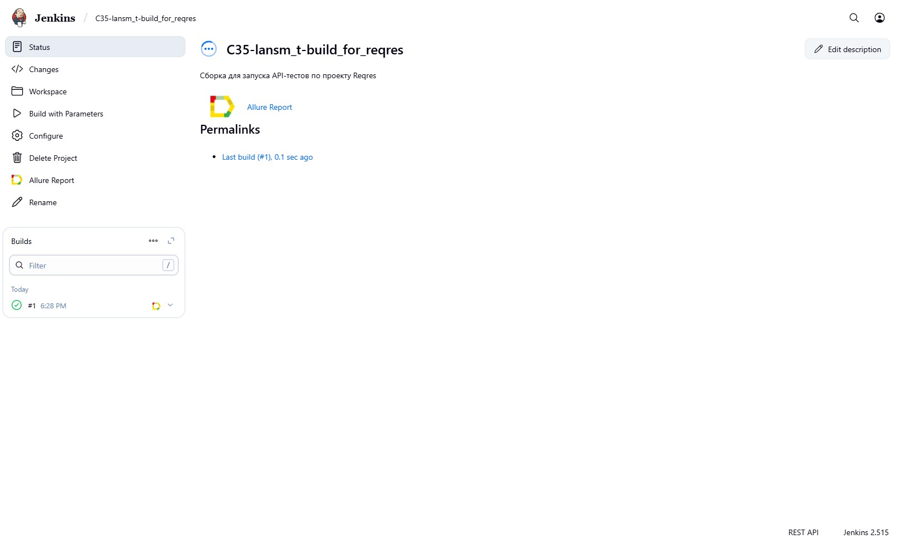
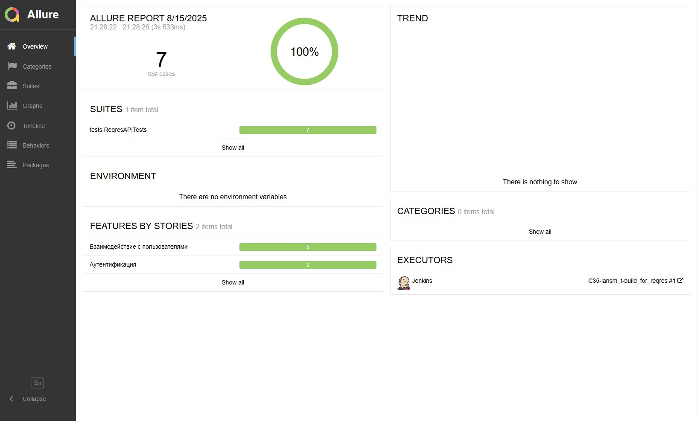
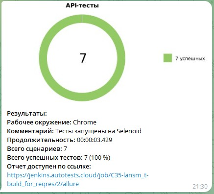

# Проект по автоматизации API-тестов для проекта [Reqres.In](https://reqres.in)


## Содержание:

- [Технологии и инструменты](#технологии-и-инструменты)
- [Тестовые сценарии](#тестовые-сценарии)
- [Сборка в Jenkins](#jenkins-build)
- [Запуск из терминала](#команды-для-запуска-из-терминала)
- [Allure отчет](#allure-report)
- [Уведомление в Telegram при помощи бота](#уведомление-в-telegram-при-помощи-бота)

- Тесты реализованы на <code>Java</code> с использованием фреймворка <code>Selenide</code>.
- В качестве сборщика используется <code>Gradle</code>.
- Для модульного тестирования применён фреймворк <code>JUnit 5</code>.
- Для работы с API используется <code>Rest Assured</code>.

---

### Технологии и инструменты:
<table>
  <tr>
    <th><a href="https://selenide.org/" target="_blank">Selenide</a>
    <th><a href="https://rest-assured.io/" target="_blank">Rest Assured</a></th>
    <th><a href="https://www.oracle.com/java/" target="_blank">Java</a></th>
    <th><a href="https://www.jetbrains.com/idea/" target="_blank">IntelliJ IDEA</a></th>
    <th><a href="https://github.com/" target="_blank">GitHub</a></th>
    <th><a href="https://junit.org/junit5/" target="_blank">JUnit 5</a></th>
    <th><a href="https://gradle.org/" target="_blank">Gradle</a></th>
    <th><a href="https://qameta.io/" target="_blank">Allure</a></th>
  </tr>
</table>

## Тестовые сценарии
- Тест №1: Получение данных зарегистрированного пользователя - GET
- Тест №2: Создание нового пользователя через API - POST
- Тест №3: Удаление пользователя - DELETE
- Тест №4: Регистрация пользователя - POST
- Тест №5: Авторизация пользователя - POST
- Тест №6: Обновление данных пользователя - PUT
- Тест №7: Обновление данных пользователя - PATCH
---
<h3 id="jenkins-build"> 
   Сборка в <a href="https://jenkins.autotests.cloud/job/C35-lansm_t-build_for_reqres/">Jenkins</a>
</h3>

**Параметры сборки в Jenkins:**

- **browser** (браузер для ui-части тестов, по умолчанию chrome)
- **browserVersion** (версия браузера, по умолчанию 128.0)
- **browserSize** (размер окна браузера, по умолчанию 1920x1080)
- **selenoidLogin** (логин удаленного сервера Selenoid)
- **selenoidPassword** (пароль удаленного сервера Selenoid)



---
## :rocket: Команды для запуска

```bash
gradle clean test
```

```bash
./gradlew.bat clean test
```
---

<h3 id="allure-report">
  
  Allure <a href="https://jenkins.autotests.cloud/job/C35-lansm_t-build_for_reqres/allure/">отчёт</a>
</h3>



---
### Уведомление в Telegram при помощи бота

